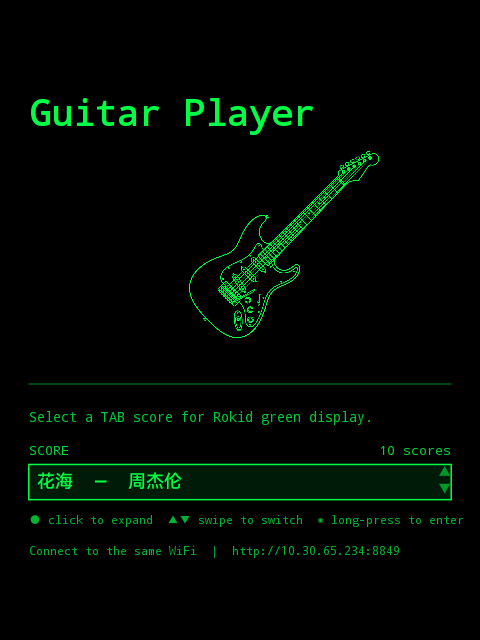
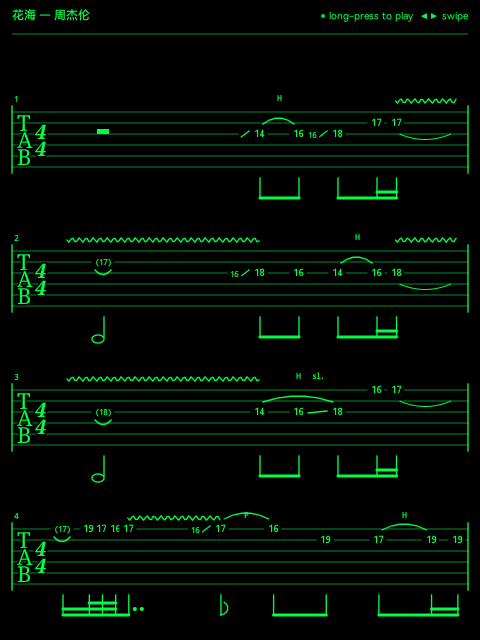

#  RokidMusic — 电吉他六线谱阅读器

Rokid Glass 上的电吉他 Tab 谱阅读/播放/编辑工具。绿色单色 Canvas 渲染 + PCM 合成音频 + WiFi 手机传谱。

<p align="center">
&nbsp;&nbsp;&nbsp;&nbsp;

</p>

## 功能

- 🎸 **Canvas 六线谱渲染**: 时序优先的逐行排版，完整节奏标记、技巧符号（推弦、滑音、击勾弦、颤音、闷音等）
- 🔊 **AudioTrack 播放**: 低延迟 PCM 吉他合成，可调速
- 📱 **WiFi 传谱**: 眼镜启动嵌入式 HTTP 服务器（端口 8849），手机/PC 浏览器上传/删除 `.tab.json` 乐谱
- ✏️ **Web 编辑器**: `tab_renderer.html` 提供完整浏览器端编辑、播放、选区操作和撤销栈
- 🔄 **自动重连**: WiFi 状态变化自动重启服务器，`ConnectivityManager.NetworkCallback` 监听

## 操作方式

### 眼镜端（触摸板）

| 状态 | 点击 | 滑动 | 长按 | 返回 |
|---|---|---|---|---|
| 列表收起 | 展开列表 | — | 进入当前选中乐谱 | 退出 |
| 列表展开 | 确认选中 + 收起 | 上下选择（自动滚动） | — | 收起列表 |

### 手机/PC 端（浏览器）

打开 `http://<眼镜IP>:8849` 上传、删除、管理 `.tab.json` 乐谱文件。

## 文件结构

```
RokidMusic/
├── app/src/main/java/com/rokid/music/
│   ├── MainActivity.kt       # 全屏 Activity，启动 HTTP 服务器
│   ├── StartScreenView.kt    # 开始页 Canvas UI（乐谱列表、吉他剪影）
│   ├── PlayerView.kt         # 播放器 Canvas 渲染 + 播放控制
│   ├── TabRenderer.kt        # 六线谱排版引擎
│   ├── AudioEngine.kt        # PCM 合成 AudioTrack 播放
│   └── ScoreServer.kt        # 嵌入式 HTTP 服务器（端口 8849）
├── tab_renderer.html         # Web 渲染器 & 编辑器（~5700 行）
├── data/music/               # .tab.json 乐谱文件
├── tools/                    # 辅助脚本（图像转 JSON、开发服务器等）
├── rules/                    # 开发规范文档（渲染、播放、编辑、转录等）
├── dev.sh                    # 构建/安装/日志 一键脚本
├── build.gradle.kts
└── settings.gradle.kts
```

### `.tab.json` 乐谱格式

自定义 JSON 格式，支持：
- 每音符时长编码、技巧装饰器（bend/slide/vibrato/hammer-on/pull-off 等）
- 范围技巧（let-ring、P.M. 闷音）、连音线、圆滑线
- 泛音标记、环音符、连音括号、速度覆盖

详见 `rules/tab-json.md`。

## 构建 & 部署

```bash
./dev.sh build     # 编译 APK
./dev.sh install   # 安装到已连接眼镜
./dev.sh run       # 构建 + 安装 + 启动
./dev.sh log       # 实时日志
./dev.sh devices   # 列出 ADB 设备
```

## Web 编辑器（本地开发）

```bash
python3 tools/dev_score_server.py --port 8765
# 打开 http://localhost:8765/tab_renderer.html
```

> ⚠️ 必须使用 `dev_score_server.py`，不能用 `python3 -m http.server` — 编辑器保存依赖 `/api/save-score` 端点。

## 状态

核心功能完成（2026-07）。剩余优化方向：真实吉他采样音源、语音指令、固件兼容性验证。
