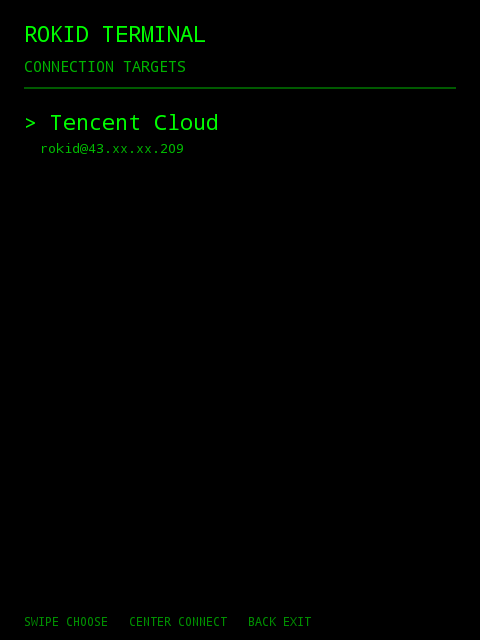
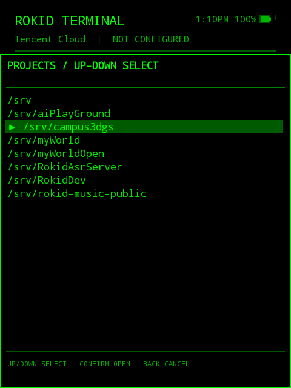
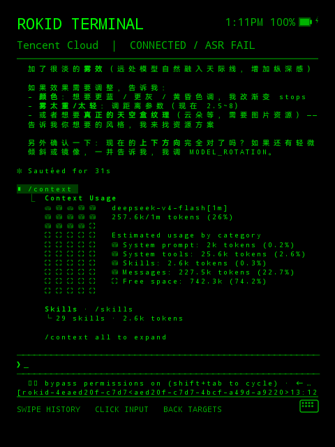

#  RokidTerminal（RokidTerm）

面向 Rokid Glass 的**远程 Claude Code 终端客户端**。App 通过 SSH 直连远程开发服务器，附着到命名 `tmux` 会话上运行 Claude Code（DeepSeek 凭据），把终端画面渲染到眼镜的绿色单色屏上。

功能：真实发送/接收 Claude 对话、本地输入框（composer）、服务端语音输入（SenseVoice）、本地历史捕获与持久化、多输入设备支持、命令面板（动态命令列表）。

<p align="center">
&nbsp;&nbsp;&nbsp;&nbsp;
&nbsp;&nbsp;&nbsp;&nbsp;

</p>

## 架构

```
SSH PTY 字节流
-> 连续 UTF-8 解码（SshTerminalSession）
-> VT/ANSI 状态机（TerminalScreen）
-> 不可变帧（TerminalFrame）
-> Canvas 渲染（TerminalView）
```

- **网络层**（`SshTerminalSession`）只负责传输与解码，不解析终端语义。
- **终端模拟**（`TerminalOutputProcessor` + `TerminalScreen`）无 Android 依赖，可独立 JVM 测试。
- **渲染层**（`TerminalView`）只渲染，不持有或修改屏幕状态。
- 完整规则文档见 `rules/`：`architecture.md`、`input.md`、`composer.md`、`rendering.md`、`voice.md`。

## 已验证的硬件状态

- 公钥 SSH 登录腾讯云服务器（非特权 `rokid` 用户）。
- 服务器 ED25519 主机密钥独立验证并固定（Bouncy Castle）。
- 断线重连恢复 `cloud-claude` tmux 会话；运行中的任务（如 `sleep`）不受影响。
- Claude 通过 `/home/rokid/bin/rokid-claude` 启动（独立 `rokid` 凭据），带 `--effort max --dangerously-skip-permissions`。
- 显示网格 **54 列 × 36 行**（480×640，实测确认），完整宽字符处理。
- `FLAG_KEEP_SCREEN_ON` 保持屏幕常亮；`FLAG_SECURE`（截图保护）开发期关闭（便于 ADB 截图与终端流调试），**2026-08-14 README 截图采集完成后启用**（开源加固）。
- 语音输入端到端验证（2026-08-05）：录音 → 服务端 SenseVoice 识别（`asr-fwd` 通道）→ 草稿 → 发送。

## 输入设备

| 设备 | 绑定状态 |
|---|---|
| **Rokid 触摸板**（TP） | ✅ 单击/滑动/长按/快门（长按与快门经系统广播拦截） |
| **COIDEA KM 小键盘** | ✅ 双旋钮 ×5 动作 + 6 键，语义按模式分发（合同见 `rules/input.md`） |
| **INMO Ring4 戒指** | ✅ 触控板（单击/双击/左右滑/长按）+ GO 键（单击/双击/长按仲裁） |
| ~~第二个 INMO 戒指~~ | ❌ 无法可靠开机，不支持（2026-08-06 决定） |

## 终端历史

- **会话内捕获**：Claude Code 使用重绘式渲染（绝对定位改写、无滚动转义码），处理器通过**基线对比**检测内容上移，把滚出屏幕的对话行推入本地历史（上限 5000 行）。**流式输出（2026-08-13/14 加固）**：快节奏原地覆盖重绘（如 `seq 1 2000` 刷屏）基线对比全部失效——模拟器级"替换前捕获"在行被覆盖前把稳定内容收进历史（50ms 稳定门槛 + 暂存确认），`seq 1 2000` 完整可浏览。
- **捕获噪声过滤（2026-08-14）**：Claude TUI 的瞬态 UI 行按**内容特征**排除（位置会随版本漂移）：思考/工具状态行（spinner 字符、计时器、`(thinking…)`）、管道符 markdown 表格（流式中间态，收尾才重绘成盒式表格）、`⎿` 工具执行块（命令输入+输出+Tip）；**重绘碎片规则**——被覆盖行的内容仍以相同/更长形式存在于屏幕其他行即视为中间态跳过（❯ 用户行豁免），一行规则消除多世代碎片交错、表格重复。
- **持久化（2026-08-06，增量 2026-08-14）**：按端点保存到 app 私有目录（`files/scrollback_<端点>.txt`），除退出/断开外，**每 +500 行**及**每轮对话结束**（输出静默 3 秒，用户阅读/输入的空闲期）增量写入——异常退出最多丢最后几十行；每次落盘前先清理屏幕副本与噪声行。重连时恢复；文件保留最近 1000 行（约 50-150 轮对话），每次会话覆写、不累积。背景色以 SGR 标记内联保存，用户消息块的深色填充跨会话保留。
- **导入折行（2026-08-14）**：服务端 transcript export 输出逻辑行（上限 100 → 2000 字符），App 导入时按 54 列**折行**而非截断（背景跨行延续），恢复的历史与活屏一致；长 prompt 不再断尾。
- **重连历史（2026-08-14）**：重连导入的 export 历史与活屏无缝衔接——浏览视图自动跳过与活屏重复的尾部（渲染层重叠检测，不依赖时序；正向锚 + 向上锚双策略）；导入行统一加 2 空格缩进、`❯` 用户消息行恢复深色背景高亮，浏览效果与应用内实时一致。
- 历史浏览：左/上 = 更旧，右/下 = 更新；浏览时有新输出到达显示 `NEW OUTPUT` 提示。

## 输入框（Composer）与语音

- 本地输入框覆盖在仍实时更新的终端之上：Unicode 字素级编辑、光标移动、退格删除、显式发送/取消。
- 发送 = TP 长按 / 左旋钮双击；取消 = 右旋钮单击 / 双击（500ms 窗口）。
- 语音 = 左旋钮单击开始/停止录音，服务端 SenseVoice 识别后填入草稿，确认后发送。
- **旋钮选字/选数（2026-08-14）**：非录音状态下，左旋钮旋转在光标处选字母（a-z→A-Z，52 项）、右旋钮选数字（0-9）；初始仅右旋唤醒，边界（a 前 / Z 后）停住不回绕；停止 1 秒即确认写入草稿（可当正常文字删除），再旋转重新唤醒；其他输入操作会放弃未确认的候选。
- 忙时发送已验证：Claude 忙碌（如执行长命令）时发送的消息会被 Claude Code 自身排队，任务结束后按顺序处理，行为与桌面终端一致。
- 超长文本发送（2026-08-13 加固）：Claude Code 的粘贴突发检测会吞掉突发窗口内的结尾 `\r`，导致长草稿卡在输入栏。发送后自动**验证输入栏**：草稿残留则补发 Enter（在观察到失败后发出，必然在突发窗口外，任意长度/网络都成立），重试仍失败则 Ctrl+U 清空输入栏防止与下条消息合并。470/750 字草稿已真机验证。

## 输入历史与建议

- 本地输入历史缓存 50 条；浏览序列：[最旧…最新] → 空条目（可显示远端建议的浅色文本）→ 深色建议。
- 键 4 = 更旧、键 6 = 更新；建议文本不存入历史（临时性），TP/戒指长按填充到输入框。
- Claude 的下一输入建议（输入行浅色文本）自动提取，右键/长按 TP 填充。

## 渲染约定

- 输入行：`❯` 提示符 + 闪烁 `_` 光标，无深色背景。
- 对话区用户消息（实屏与历史）：小方框标记 + 深色背景块。
- 对话/输出用 SGR 背景色区分（历史行自动推断填充）。

## 构建 & 部署

```bash
./dev.sh build   # 构建 debug APK
./dev.sh run     # 构建 → 安装 → 启动
./dev.sh log     # 实时日志
```

单元测试（终端解析器/渲染策略/滚动捕获回归）：

```bash
export JAVA_HOME="/Applications/Android Studio.app/Contents/jbr/Contents/Home"
export ANDROID_HOME="$HOME/Library/Android/sdk"
./gradlew testDebugUnitTest assembleDebug
```

## 安全约束

- 不提交/不记录任何服务器密码、私钥、API 密钥或 Claude 凭据。
- 私钥存于 app 私有存储，Android Keystore AES-GCM 加密；禁止放 `/sdcard`。
- 严格主机认证（固定 ED25519 主机密钥），无 TOFU/「接受任意主机」回退。
- 服务器账号为非特权 `rokid` 用户（无 sudo、非 docker 等特权组），authorized_keys 带限制。
- 语音文本必须先显示为草稿、显式确认后才发送，不做任意语音→shell 执行。
- 日志中不输出草稿文本、识别文本、终端正文或源码。
- 截图保护（`FLAG_SECURE`）：README 截图采集完成后启用（2026-08-14 决定）。

## 服务端 ASR（third_party/asr-server）

FastAPI + SenseVoiceSmall 的服务端语音识别，作为 RokidTerm 组件维护（非独立仓库）。仅在 127.0.0.1 绑定，由受限 `asr-fwd` SSH 账号转发；识别结果不落盘、不记录转写日志。详见其目录内 `CLAUDE.md`。

## 服务端会话助手（server/）

对话选择器与并发会话（2026-08-11，加固并真机验证 2026-08-13）由服务器端
`rokid-sessions` helper 驱动：
每对话一个 tmux window（`rokid-<对话id>`），**切换 = attach 语义**（进程永不因切换被杀，
后台任务持续运行），删除对话 = kill-window（进程随之结束），空闲后台对话被清扫
（默认 3 小时，三重信号防误杀，选中窗口永不清扫；App 连接时每 5 分钟自动执行一次）。
窗口定位全部按**索引**（tmux 窗口名可不唯一，重名会使按名定位失效；清扫会自动把重名
窗口改名回其真实对话）。新建对话的 id 收敛只认"切换后新出现"的会话，绝不串到旧对话。
删除从未发过消息的新对话也视为成功（其窗口即对话本体）。

换服务器一键部署 + 冒烟（目标需可 ssh/scp，装有 tmux、python3、procps、coreutils；
lsof 仅回退路径可选）：

```bash
bash server/deploy.sh <user>@<host>            # 部署 helper 并在目标上跑完整 harness
bash server/deploy.sh <user>@<host> /opt/claude/rokid-claude   # 自定义启动器路径
```

- 环境变量覆盖（无需改脚本）：`ROKID_SESSIONS_PROJECTS_DIR`（对话存储目录，默认
  `$HOME/.claude/projects`）、`ROKID_SESSIONS_LAUNCHER`（Claude 启动器，默认
  `/home/rokid/bin/rokid-claude`）。
- 清扫调参：`rokid-sessions sweep <tmux-session> <base-dir> <idle-minutes>`（App 每 5 分钟
  自动调一次，默认 180 分钟）。
- 建议同时运行的对话 2-3 个（每个空闲进程约占 ~200-500MB 内存），不强制限制。
- 本地 harness：`bash server/test/helper_test.sh [filter]`（macOS tmux + 假 claude，无需服务器）。
- 界面 HUD（2026-08-12/13）：标题行右上角实时时钟（12 小时制 AM/PM，无空格）+
  电池图标（百分比 + 充电 ⚡），电量经系统粘性广播推送、零轮询；ASR 结果末尾的
  表情符号自动剥离（`stripTrailingEmoji`，Unicode 区块判定）。

## 已知限制 / 待办

- 会话恢复 + 并发会话已实现并真机验证（2026-08-13）：连接时 / 会话内两层对话选择器，
  基于服务端 `rokid-sessions` helper（list/status/switch/delete/export/adopt/sweep）+
  每会话滚动历史；切换对话/退出 App 后台任务持续运行、可随时切回；删除对话干净回收
  （窗口/进程/文件）；空闲对话自动清扫（连接时每 5 分钟）。
- 发布前：启用 `FLAG_SECURE`（截图采集已完成，2026-08-14）、release 清理、移除调试路径。
